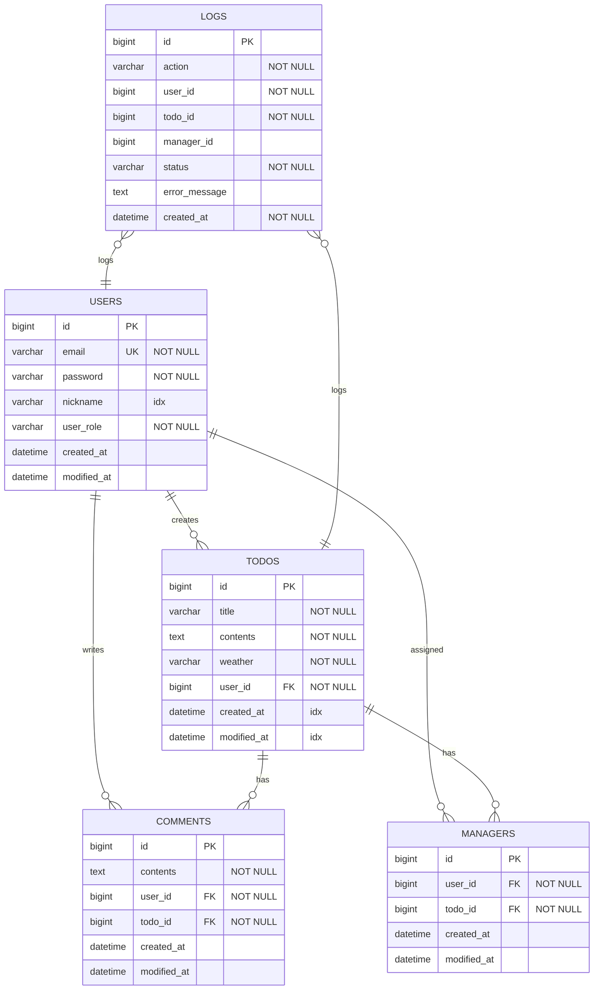

# Spring Plus 프로젝트

> Spring Boot 기반 TODO 관리 애플리케이션
>
> JPA 심화, QueryDSL, Spring Security를 활용한 실무 중심 프로젝트

## 📋 목차

- [프로젝트 소개](#-프로젝트-소개)
- [기술 스택](#-기술-스택)
- [주요 기능](#-주요-기능)
- [ERD](#-erd)
- [API 명세서](#-api-명세서)
- [프로젝트 구조](#-프로젝트-구조)
- [설치 및 실행](#-설치-및-실행)

---

## 🎯 프로젝트 소개

Spring Plus는 실무에서 자주 마주하는 문제들을 해결하며 학습할 수 있도록 설계된 TODO 관리 애플리케이션입니다.

### 핵심 학습 목표

- **JPA 심화**: N+1 문제 해결, Cascade, QueryDSL
- **트랜잭션 관리**: 전파 레벨을 활용한 독립적 트랜잭션 처리
- **Spring Security**: JWT 기반 인증/인가
- **성능 최적화**: 인덱스 설계, 쿼리 최적화
- **AOP**: 횡단 관심사 분리

---

## 🛠 기술 스택

### Backend
- **Java 17**
- **Spring Boot 3.3.3**
- **Spring Security**
- **Spring Data JPA**
- **QueryDSL 5.0.0**

### Database
- **MySQL 8.0**
- **H2** (테스트용)

### Build Tool
- **Gradle 8.x**

### Others
- **JWT** (인증)
- **BCrypt** (비밀번호 암호화)
- **Lombok**

---

## ✨ 주요 기능

### Level 1: 기본 기능
- ✅ `@Transactional` readOnly 이슈 해결
- ✅ JWT에 nickname 추가
- ✅ JPA 동적 쿼리 (weather, 날짜 범위 검색)
- ✅ 컨트롤러 테스트 코드 수정
- ✅ AOP를 활용한 관리자 접근 로깅

### Level 2: 고급 기능
- ✅ JPA Cascade를 통한 담당자 자동 등록
- ✅ N+1 문제 해결 (JOIN FETCH)
- ✅ QueryDSL 전환
- ✅ Spring Security 도입

### Level 3: 실무 기능
- ✅ QueryDSL + Projections 검색 최적화
- ✅ Transaction 전파 레벨을 활용한 로그 분리

---

## 📊 ERD



### 테이블 설명

#### USERS (사용자)
| 컬럼명 | 타입 | 제약조건 | 설명 |
|--------|------|----------|------|
| id | BIGINT | PK, AUTO_INCREMENT | 사용자 ID |
| email | VARCHAR(255) | UNIQUE, NOT NULL | 이메일 (로그인 ID) |
| password | VARCHAR(255) | NOT NULL | 암호화된 비밀번호 |
| nickname | VARCHAR(255) | INDEX | 닉네임 |
| user_role | VARCHAR(20) | NOT NULL | USER, ADMIN |
| created_at | DATETIME | NOT NULL | 생성일시 |
| modified_at | DATETIME | NOT NULL | 수정일시 |

**인덱스:**
- `idx_user_nickname` ON (nickname)

#### TODOS (할 일)
| 컬럼명 | 타입 | 제약조건 | 설명 |
|--------|------|----------|------|
| id | BIGINT | PK, AUTO_INCREMENT | 할 일 ID |
| title | VARCHAR(255) | NOT NULL | 제목 |
| contents | TEXT | NOT NULL | 내용 |
| weather | VARCHAR(50) | NOT NULL | 날씨 정보 |
| user_id | BIGINT | FK, NOT NULL | 작성자 ID |
| created_at | DATETIME | NOT NULL, INDEX | 생성일시 |
| modified_at | DATETIME | NOT NULL, INDEX | 수정일시 |

**인덱스:**
- `idx_modified_at` ON (modified_at)
- `idx_weather` ON (weather)

**외래키:**
- `user_id` REFERENCES USERS(id) ON DELETE CASCADE

#### COMMENTS (댓글)
| 컬럼명 | 타입 | 제약조건 | 설명 |
|--------|------|----------|------|
| id | BIGINT | PK, AUTO_INCREMENT | 댓글 ID |
| contents | TEXT | NOT NULL | 댓글 내용 |
| user_id | BIGINT | FK, NOT NULL | 작성자 ID |
| todo_id | BIGINT | FK, NOT NULL | 할 일 ID |
| created_at | DATETIME | NOT NULL | 생성일시 |
| modified_at | DATETIME | NOT NULL | 수정일시 |

**외래키:**
- `user_id` REFERENCES USERS(id) ON DELETE CASCADE
- `todo_id` REFERENCES TODOS(id) ON DELETE CASCADE

#### MANAGERS (담당자)
| 컬럼명 | 타입 | 제약조건 | 설명 |
|--------|------|----------|------|
| id | BIGINT | PK, AUTO_INCREMENT | 담당자 ID |
| user_id | BIGINT | FK, NOT NULL | 담당자 사용자 ID |
| todo_id | BIGINT | FK, NOT NULL | 할 일 ID |
| created_at | DATETIME | NOT NULL | 생성일시 |
| modified_at | DATETIME | NOT NULL | 수정일시 |

**외래키:**
- `user_id` REFERENCES USERS(id) ON DELETE CASCADE
- `todo_id` REFERENCES TODOS(id) ON DELETE CASCADE

#### LOGS (로그)
| 컬럼명 | 타입 | 제약조건 | 설명 |
|--------|------|----------|------|
| id | BIGINT | PK, AUTO_INCREMENT | 로그 ID |
| action | VARCHAR(50) | NOT NULL | 액션 타입 (REGISTER_MANAGER) |
| user_id | BIGINT | NOT NULL | 요청 사용자 ID |
| todo_id | BIGINT | NOT NULL | 대상 할 일 ID |
| manager_id | BIGINT | NULL | 등록된 매니저 ID |
| status | VARCHAR(20) | NOT NULL | SUCCESS, FAILED |
| error_message | TEXT | NULL | 에러 메시지 |
| created_at | DATETIME | NOT NULL | 로그 생성일시 |

---

## 📡 API 명세서

### Base URL
```
http://localhost:8080
```

### 인증 방식
```
Authorization: Bearer {JWT_TOKEN}
```

---

### 1. 인증 API

#### 1.1 회원가입
```http
POST /auth/signup
Content-Type: application/json
```

**Request Body**
```json
{
  "email": "user@example.com",
  "password": "Password123",
  "nickname": "홍길동",
  "userRole": "USER"
}
```

**Response 200 OK**
```json
{
  "bearerToken": "Bearer eyJhbGciOiJIUzI1NiIsInR5cCI6IkpXVCJ9..."
}
```

**Error Responses**
| Status | Message |
|--------|---------|
| 400 | 이미 존재하는 이메일입니다 |
| 400 | 유효하지 않은 UserRole |

---

#### 1.2 로그인
```http
POST /auth/signin
Content-Type: application/json
```

**Request Body**
```json
{
  "email": "user@example.com",
  "password": "Password123"
}
```

**Response 200 OK**
```json
{
  "bearerToken": "Bearer eyJhbGciOiJIUzI1NiIsInR5cCI6IkpXVCJ9..."
}
```

**Error Responses**
| Status | Message |
|--------|---------|
| 400 | 가입되지 않은 유저입니다 |
| 401 | 잘못된 비밀번호입니다 |

---

### 2. 사용자 API

#### 2.1 사용자 조회
```http
GET /users/{userId}
Authorization: Bearer {token}
```

**Response 200 OK**
```json
{
  "id": 1,
  "email": "user@example.com"
}
```

**Error Responses**
| Status | Message |
|--------|---------|
| 400 | User not found |
| 401 | 인증 필요 |

---

#### 2.2 비밀번호 변경
```http
PUT /users
Authorization: Bearer {token}
Content-Type: application/json
```

**Request Body**
```json
{
  "oldPassword": "OldPassword123",
  "newPassword": "NewPassword123"
}
```

**Response 200 OK**

**Error Responses**
| Status | Message |
|--------|---------|
| 400 | 새 비밀번호는 기존 비밀번호와 같을 수 없습니다 |
| 400 | 잘못된 비밀번호입니다 |
| 400 | 새 비밀번호는 8자 이상이어야 하고, 숫자와 대문자를 포함해야 합니다 |

---

### 3. 관리자 API

#### 3.1 사용자 권한 변경
```http
PATCH /admin/users/{userId}
Authorization: Bearer {token} (ADMIN 권한 필요)
Content-Type: application/json
```

**Request Body**
```json
{
  "role": "ADMIN"
}
```

**Response 200 OK**

**Error Responses**
| Status | Message |
|--------|---------|
| 400 | User not found |
| 400 | 유효하지 않은 UserRole |
| 403 | 관리자 권한이 없습니다 |

---

### 4. 할 일 API

#### 4.1 할 일 생성
```http
POST /todos
Authorization: Bearer {token}
Content-Type: application/json
```

**Request Body**
```json
{
  "title": "프로젝트 완료하기",
  "contents": "Spring Plus 과제를 완료한다"
}
```

**Response 200 OK**
```json
{
  "id": 1,
  "title": "프로젝트 완료하기",
  "contents": "Spring Plus 과제를 완료한다",
  "weather": "Sunny",
  "user": {
    "id": 1,
    "email": "user@example.com"
  }
}
```

**Error Responses**
| Status | Message |
|--------|---------|
| 400 | title, contents는 필수입니다 |
| 500 | 날씨 데이터를 가져오는데 실패했습니다 |

---

#### 4.2 할 일 목록 조회 (동적 검색)
```http
GET /todos?page=1&size=10&weather=Sunny&startDate=2024-01-01T00:00:00&endDate=2024-12-31T23:59:59
Authorization: Bearer {token}
```

**Query Parameters**
| Parameter | Type | Required | Default | Description |
|-----------|------|----------|---------|-------------|
| page | Integer | No | 1 | 페이지 번호 |
| size | Integer | No | 10 | 페이지 크기 |
| weather | String | No | - | 날씨 조건 |
| startDate | DateTime | No | - | 수정일 시작 (ISO 8601) |
| endDate | DateTime | No | - | 수정일 종료 (ISO 8601) |

**Response 200 OK**
```json
{
  "content": [
    {
      "id": 1,
      "title": "프로젝트 완료하기",
      "contents": "Spring Plus 과제를 완료한다",
      "weather": "Sunny",
      "user": {
        "id": 1,
        "email": "user@example.com"
      },
      "createdAt": "2024-12-29T10:00:00",
      "modifiedAt": "2024-12-29T10:00:00"
    }
  ],
  "pageable": {
    "pageNumber": 0,
    "pageSize": 10
  },
  "totalElements": 50,
  "totalPages": 5
}
```

---

#### 4.3 할 일 단건 조회
```http
GET /todos/{todoId}
Authorization: Bearer {token}
```

**Response 200 OK**
```json
{
  "id": 1,
  "title": "프로젝트 완료하기",
  "contents": "Spring Plus 과제를 완료한다",
  "weather": "Sunny",
  "user": {
    "id": 1,
    "email": "user@example.com"
  },
  "createdAt": "2024-12-29T10:00:00",
  "modifiedAt": "2024-12-29T10:00:00"
}
```

**Error Responses**
| Status | Message |
|--------|---------|
| 400 | Todo not found |

---

#### 4.4 할 일 고급 검색 (QueryDSL + Projections)
```http
GET /todos/search?keyword=프로젝트&startDate=2024-01-01&endDate=2024-12-31&managerNickname=홍길동&page=1&size=10
Authorization: Bearer {token}
```

**Query Parameters**
| Parameter | Type | Required | Default | Description |
|-----------|------|----------|---------|-------------|
| keyword | String | No | - | 제목 검색 (부분 일치) |
| startDate | Date | No | - | 생성일 시작 (yyyy-MM-dd) |
| endDate | Date | No | - | 생성일 종료 (yyyy-MM-dd) |
| managerNickname | String | No | - | 담당자 닉네임 (부분 일치) |
| page | Integer | No | 1 | 페이지 번호 |
| size | Integer | No | 10 | 페이지 크기 |

**Response 200 OK**
```json
{
  "content": [
    {
      "id": 1,
      "title": "프로젝트 완료하기",
      "managerCount": 3,
      "commentCount": 5,
      "createdAt": "2024-12-29T10:00:00"
    }
  ],
  "pageable": {
    "pageNumber": 0,
    "pageSize": 10
  },
  "totalElements": 20,
  "totalPages": 2
}
```

**특징**
- Projections를 활용한 필요 필드만 조회 (성능 최적화)
- 생성일 최신순 정렬
- 모든 검색 조건 optional

---

### 5. 댓글 API

#### 5.1 댓글 생성
```http
POST /todos/{todoId}/comments
Authorization: Bearer {token}
Content-Type: application/json
```

**Request Body**
```json
{
  "contents": "좋은 아이디어네요!"
}
```

**Response 200 OK**
```json
{
  "id": 1,
  "contents": "좋은 아이디어네요!",
  "user": {
    "id": 1,
    "email": "user@example.com"
  }
}
```

**Error Responses**
| Status | Message |
|--------|---------|
| 400 | Todo not found |
| 400 | contents는 필수입니다 |

---

#### 5.2 댓글 목록 조회 (N+1 해결)
```http
GET /todos/{todoId}/comments
Authorization: Bearer {token}
```

**Response 200 OK**
```json
[
  {
    "id": 1,
    "contents": "좋은 아이디어네요!",
    "user": {
      "id": 1,
      "email": "user@example.com"
    }
  },
  {
    "id": 2,
    "contents": "저도 동의합니다.",
    "user": {
      "id": 2,
      "email": "user2@example.com"
    }
  }
]
```

**특징**
- `JOIN FETCH`를 통한 N+1 문제 해결
- 단일 쿼리로 댓글과 작성자 정보 조회

---

### 6. 담당자 API

#### 6.1 담당자 등록 (Transaction 전파 + 로그)
```http
POST /todos/{todoId}/managers
Authorization: Bearer {token}
Content-Type: application/json
```

**Request Body**
```json
{
  "managerUserId": 2
}
```

**Response 200 OK**
```json
{
  "id": 1,
  "user": {
    "id": 2,
    "email": "manager@example.com"
  }
}
```

**Error Responses**
| Status | Message |
|--------|---------|
| 400 | Todo not found |
| 400 | 담당자를 등록하려고 하는 유저가 유효하지 않거나, 일정을 만든 유저가 아닙니다 |
| 400 | 등록하려고 하는 담당자 유저가 존재하지 않습니다 |
| 400 | 일정 작성자는 본인을 담당자로 등록할 수 없습니다 |

**특징**
- 성공/실패 여부와 관계없이 LOGS 테이블에 기록
- `@Transactional(propagation = REQUIRES_NEW)` 적용
- 매니저 등록 실패 시에도 로그는 반드시 저장됨

---

#### 6.2 담당자 목록 조회
```http
GET /todos/{todoId}/managers
Authorization: Bearer {token}
```

**Response 200 OK**
```json
[
  {
    "id": 1,
    "user": {
      "id": 1,
      "email": "creator@example.com"
    }
  },
  {
    "id": 2,
    "user": {
      "id": 2,
      "email": "manager@example.com"
    }
  }
]
```

**Error Responses**
| Status | Message |
|--------|---------|
| 400 | Todo not found |

---

#### 6.3 담당자 삭제
```http
DELETE /todos/{todoId}/managers/{managerId}
Authorization: Bearer {token}
```

**Response 200 OK**

**Error Responses**
| Status | Message |
|--------|---------|
| 400 | Todo not found |
| 400 | Manager not found |
| 400 | 해당 일정을 만든 유저가 유효하지 않습니다 |
| 400 | 해당 일정에 등록된 담당자가 아닙니다 |

---

### 7. 헬스 체크 API

#### 7.1 헬스 체크
```http
GET /health
```

**Response 200 OK**
```json
{
  "status": "UP",
  "timestamp": "2024-12-29T10:00:00",
  "service": "Spring Plus Application"
}
```

**특징**
- 인증 불필요 (public endpoint)
- 서버 상태 확인용

---

## 📁 프로젝트 구조

```
src/
├── main/
│   ├── java/org/example/expert/
│   │   ├── aop/                          # AOP 설정
│   │   │   └── AdminAccessLoggingAspect  # 관리자 접근 로깅
│   │   ├── client/                       # 외부 API 클라이언트
│   │   │   └── WeatherClient             # 날씨 API 클라이언트
│   │   ├── config/                       # 설정
│   │   │   ├── JwtUtil                   # JWT 유틸리티
│   │   │   ├── SecurityConfig            # Spring Security 설정
│   │   │   ├── JwtSecurityFilter         # JWT 인증 필터
│   │   │   └── QueryDslConfig            # QueryDSL 설정
│   │   └── domain/
│   │       ├── auth/                     # 인증
│   │       │   ├── controller/
│   │       │   ├── dto/
│   │       │   ├── service/
│   │       │   └── exception/
│   │       ├── user/                     # 사용자
│   │       │   ├── controller/
│   │       │   ├── dto/
│   │       │   ├── entity/
│   │       │   ├── repository/
│   │       │   └── service/
│   │       ├── todo/                     # 할 일
│   │       │   ├── controller/
│   │       │   ├── dto/
│   │       │   ├── entity/
│   │       │   ├── repository/
│   │       │   │   ├── TodoRepository
│   │       │   │   ├── TodoRepositoryCustom
│   │       │   │   └── TodoRepositoryImpl  # QueryDSL 구현
│   │       │   └── service/
│   │       ├── comment/                  # 댓글
│   │       ├── manager/                  # 담당자
│   │       ├── log/                      # 로그
│   │       └── common/                   # 공통
│   └── resources/
│       └── application.yml
└── test/
    └── java/org/example/expert/
        └── domain/
            └── todo/
                └── controller/
                    └── TodoControllerTest    # 컨트롤러 테스트
```

---

## 🚀 설치 및 실행

### 1. 요구사항
- Java 17+
- MySQL 8.0+
- Gradle 8.x

### 2. 환경 변수 설정
```bash
# MySQL
export MYSQL_USERNAME=root
export MYSQL_PASSWORD=your_password

# JWT
export JWT_SECRET_KEY=your_jwt_secret_key_at_least_256_bits
```

### 3. 데이터베이스 생성
```sql
CREATE DATABASE springplus CHARACTER SET utf8mb4 COLLATE utf8mb4_unicode_ci;
```

### 4. 빌드 및 실행
```bash
# 빌드
./gradlew clean build

# 실행
./gradlew bootRun

# 또는
java -jar build/libs/expert-0.0.1-SNAPSHOT.jar
```

### 5. 접속 확인
```bash
curl http://localhost:8080/health
```

---
